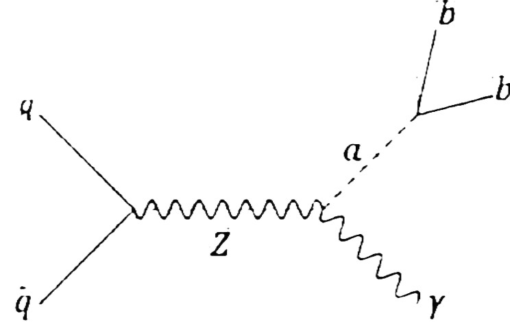
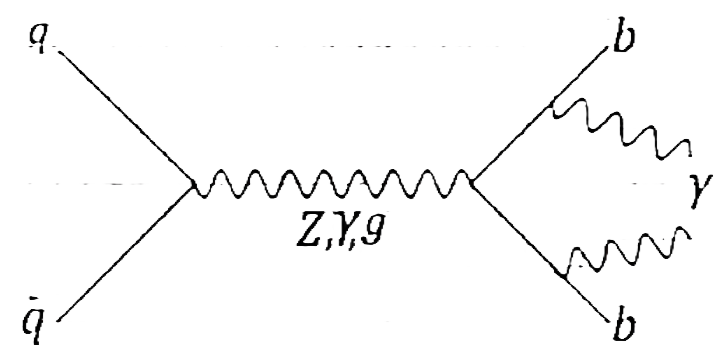

# Machine Learning for Particle Collision Event Classification  
**Signal vs. Background Event Discrimination Using ML Algorithms**  

---

## 📌 Overview  
This repository contains the implementation of various modern ML algorithms -based framework for binary classification of particle collision events simulated using MadGraph, Pythia, and Delphes. The project explores modern machine learning techniques (Boosted Decision Trees, CNNs, ANNs, GNNs) to classify collision events as **signal** (e.g., rare physics processes) or **background** (Standard Model processes). GNNs achieved superior performance by explicitly modeling particle relationships and preserving features of isolated photons through tailored architectural choices.  

  
*Figure: Signal Event Feynman Diagram*

  
*Figure: Background Event Feynman Diagram*

---

## ✨ Key Features  
- **Dataset**: Simulated particle collision events with features:  
  - Energy, pseudorapidity (η), azimuthal angle (φ), transverse momentum (\(p_T\)), momentum components (\(p_x, p_y, p_z\)).  
  - Signal/Background labels for binary classification.  
- **Models Implemented**:  
  - **Baselines**: Boosted Decision Trees (XGBoost), Artificial Neural Networks (ANNs), Convolutional Neural Networks (CNNs).  
  - **GNN Variants**: Graph Convolutional Networks (GCN), NNConv (edge-aware convolution), GatedGraphConv.
---

## 🛠️ Installation  
1. **Clone the repository**:  
   ```bash  
   git clone https://github.com/meetjain1818/Machine-Learning-for-Particle-Physics-Classification.git  
   cd Machine-Learning-for-Particle-Physics-Classification  
   ```  

2. **Install dependencies**:  
   ```bash  
   conda create -n gnn python=3.10.16  
   conda activate gnn  
   pip install -r requirements.txt  
   ```  
   **Key Libraries**:  
   - PyTorch Geometric  
   - PyTorch
   - scikit-learn  
   - pandas, numpy
   - TensorFLow 

---

## 📊 Results  
| Model       | AUC-ROC | F1-Score | Accuracy |  
|-------------|---------|----------|----------|  
| RandomForest     | 0.887    | 0.74     | 0.82     |
| Gradient Boosting     | 0.887    | 0.74     | 0.82     |
| CNN(RGB Images)         | 0.764    | 0.645     | 0.692     | 
| AlexNet(RGB Images)         | 0.85    | 0.79     | 0.83     | 
| CNN(Greyscale Images)         | 0.85    | 0.79     | 0.83     | 
| GCNConv         | 0.88    | 0.83     | 0.86     |  
| **NNConv**     | **0.92**| **0.89** | **0.90** |  
| **GatedGraphConv**     | **0.92**| **0.89** | **0.90** |  

**Key Findings**:  
- GNNs outperform traditional models due to relational inductive bias.  
- Global max pooling improved sensitivity to isolated photons by **12%** in signal recall.  

---

## 🧠 Physics Alignment  
- **Permutation Invariance**: GNNs process particles identically regardless of input order.  
- **Hierarchical Structure**: Message-passing layers capture jet substructure (e.g., subjets from boosted \(W\) bosons).  
- **Detector Geometry**: Spatial edges (\(\Delta R < 0.4\)) mimic calorimeter clustering.  

---

## 📚 References  
1. ParticleNet: [arXiv:1902.08570](https://arxiv.org/abs/1902.08570)  
2. PyTorch Geometric: [Documentation](https://pytorch-geometric.readthedocs.io)  
3. Delphes Simulation Framework: [GitHub](https://github.com/delphes/delphes)  

---

## 🙏 Acknowledgments  
- Supervised by **Prof. Abhishek M. Iyer** at Indian Institute of Technology Delhi.  
- Dataset generated using MadGraph-Pythia-Delphes workflow.  

--- 

📧 **Contact**: [meetjain1818@gmail.com]  
📜 **License**: MIT  
```  

---

### Suggested Repository Structure:  
```  
.  
├── data/  
│   ├── raw/              # Raw ROOT files  
│   └── processed/        # Preprocessed graphs (.pt files)  
├── models/               # Model definitions (GCN, GAT, NNConv, etc.)  
├── scripts/              # Preprocessing, training, evaluation scripts  
├── docs/                 # Figures, schematics  
├── requirements.txt  
└── README.md  
```  

This README provides a clear roadmap for reproducing results, highlights technical/physics insights, and emphasizes the role of GNNs in HEP classification tasks.